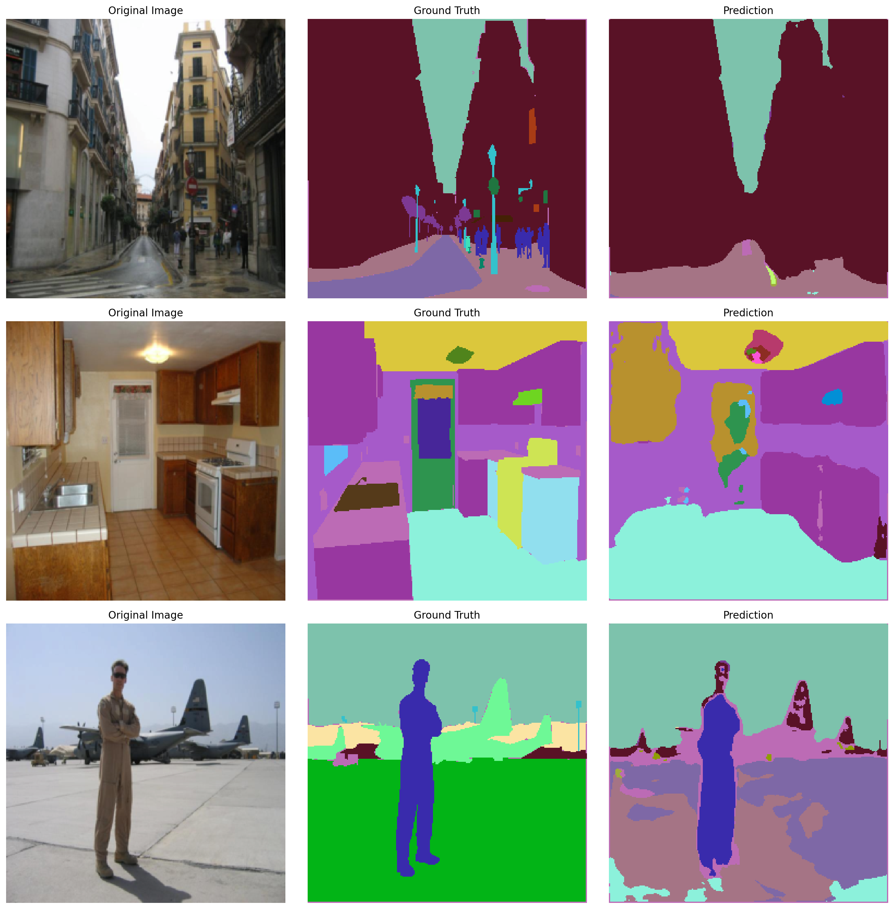

# U-Net Semantic Segmentation for ADE20K Dataset

## 📋 Project Overview

This project implements a U-Net architecture for semantic segmentation on the ADE20K dataset. It features a complete training pipeline with mixed precision training, advanced visualization techniques, and comprehensive performance metrics.

## 🔍 Architecture

The implementation uses a U-Net model with skip connections, which is well-suited for semantic segmentation tasks where preserving spatial information is critical.

```mermaid
graph TD
    Input[Input Image] --> Encoder1[Encoder Block 1: 3→64]
    Encoder1 --> Encoder2[Encoder Block 2: 64→128]
    Encoder2 --> Encoder3[Encoder Block 3: 128→256]
    Encoder3 --> Encoder4[Encoder Block 4: 256→512]
    Encoder4 --> Bottleneck[Bottleneck: 512→1024/2]
    
    Bottleneck --> Decoder1[Decoder Block 1: 1024→512/2]
    Encoder4 -- Skip Connection --> Decoder1
    
    Decoder1 --> Decoder2[Decoder Block 2: 512→256/2]
    Encoder3 -- Skip Connection --> Decoder2
    
    Decoder2 --> Decoder3[Decoder Block 3: 256→128/2]
    Encoder2 -- Skip Connection --> Decoder3
    
    Decoder3 --> Decoder4[Decoder Block 4: 128→64]
    Encoder1 -- Skip Connection --> Decoder4
    
    Decoder4 --> Output[Output: 64→150 classes]
```

## 🚀 Features

- **Architecture**: U-Net with skip connections
- **Loss Function**: Categorical Cross-Entropy for multi-class segmentation
- **Optimizer**: Adam with learning rate scheduling
- **Mixed Precision Training**: Using PyTorch's AMP for faster training
- **Data Augmentation**: Normalization and resizing
- **Metrics**: IoU (Intersection over Union) and Pixel Accuracy
- **Visualization**: Progress tracking through epochs with colored masks

## 📊 Training Performance

The model was trained for 30 epochs on the ADE20K dataset, achieving:

- **Final Training Loss**: 1.4640
- **Final Training IoU**: 0.1435
- **Final Training Accuracy**: 0.6031
- **Final Validation Loss**: 1.5139
- **Final Validation IoU**: 0.1389
- **Final Validation Accuracy**: 0.5928

## 📈 Training Progress

### Learning Curves

### Segmentation Progress

#### Initial Predictions (Before Training)

#### After 5 Epochs

#### After 10 Epochs

#### After 15 Epochs

#### After 20 Epochs

#### After 25 Epochs

#### After 30 Epochs

#### Final Model Predictions

## 🛠️ Implementation Details

### Model Architecture

The U-Net architecture consists of:
- An encoder path (contracting) that captures context
- A decoder path (expanding) that enables precise localization
- Skip connections that transfer feature maps from encoder to decoder

### Key Components

1. **Double Convolution Blocks**: Two successive 3×3 convolutions followed by batch normalization and ReLU
2. **Encoder Blocks**: Max pooling followed by double convolution
3. **Decoder Blocks**: Upsampling, concatenation with skip connection, and double convolution
4. **Skip Connections**: Feature maps from encoder blocks connected to decoder blocks

### Training Pipeline

- **Dataset**: ADE20K with 150 semantic classes
- **Image Size**: 256×256 pixels
- **Batch Size**: Adaptively set based on available GPUs
- **Learning Rate**: 0.001 with ReduceLROnPlateau scheduler
- **Training Time**: ~4.5 hours

## 💻 Usage

### Prerequisites

- Python 3.7+
- PyTorch 1.8+
- torchvision
- matplotlib
- numpy
- tqdm
- Pillow

## 🔮 Future Work

- Implement additional data augmentation techniques
- Experiment with other loss functions like Dice Loss or Focal Loss
- Try different backbone architectures
- Explore post-processing techniques for boundary refinement
- Test on other semantic segmentation datasets

## 📚 References

1. U-Net: Convolutional Networks for Biomedical Image Segmentation (Ronneberger et al., 2015)
2. ADE20K Dataset: Scene Parsing through ADE20K Dataset (Zhou et al., 2017)
3. Deep Learning for Semantic Segmentation: A Survey
